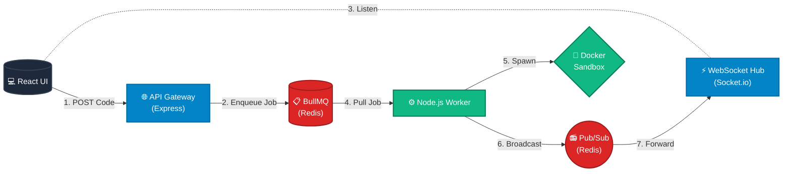

<div align="center">

# ⚡ Distributed Code Execution Platform (DCEP)

**A high-performance, fault-tolerant distributed system for secure code compilation and execution.**

[](https://nodejs.org/)
[](https://www.docker.com/)
[](https://redis.io/)
[](https://expressjs.com/)
[](https://reactjs.org/)

*Engineered for massive horizontal scalability, strictly isolating the API ingestion layer from the heavy-compute execution environment.*

</div>

---

## ✨ System Capabilities

<table>
  <tr>
    <td><b>🛡️ Ephemeral Sandboxing</b><br>Untrusted code is executed inside strictly isolated, network-disabled Docker containers with hard limits on memory and CPU.</td>
    <td><b>🌊 Asynchronous Queuing</b><br>API requests are never blocked. Submissions are pushed to a Redis-backed BullMQ cluster for guaranteed delivery and retry mechanisms.</td>
  </tr>
  <tr>
    <td><b>📡 Real-Time Telemetry</b><br>Execution metrics, stdout, and stderr are streamed instantly to the client via WebSockets and Redis Pub/Sub without long-polling.</td>
    <td><b>🚀 Horizontal Scalability</b><br>Worker nodes operate independently. Need more compute? Simply spin up more worker instances to drain the queue faster.</td>
  </tr>
</table>

## 🏗 System Architecture

DCEP utilizes a microservice architecture to separate the ingestion pipeline from the compute-heavy execution workers.



## ⚙️ Technical Deep Dive

<details>
<summary><b>Click to expand: How the Execution Engine works</b></summary>
<br>

1. **Ingestion & Rate Limiting:** The Gateway receives a payload containing the source code and target language. It validates the request and applies strict IP/API-Key rate limiting to prevent DDoS.
2. **Message Broker (BullMQ):** The job is serialized and pushed to a Redis queue. The Gateway responds immediately with a HTTP 201 and a `jobId`.
3. **Worker Processing:** An idle worker picks up the job. It utilizes `Dockerode` to dynamically provision an ephemeral Docker container.
4. **Execution & Resource Quotas:** The container is booted with no external network access, a strict timeout (e.g., 3 seconds), and memory limits. The standard output (stdout) and error (stderr) are captured via streams.
5. **Pub/Sub Telemetry:** Upon completion or timeout, the worker publishes the execution payload (exit code, logs, execution time) to a Redis Pub/Sub channel.
6. **WebSocket Bridge:** The API Gateway, listening to the Pub/Sub channel, intercepts the message and routes it via `Socket.io` directly to the specific client observing that `jobId`.

</details>

## 🚀 Quick Start (Local Cluster)

### Prerequisites
* **Node.js** (v18+)
* **Docker Desktop** (Engine must be running)
* **Redis** (Running locally on port 6379)

### 1. Bootstrapping
```bash
git clone [https://github.com/yourusername/distributed-code-execution.git](https://github.com/yourusername/distributed-code-execution.git)
cd distributed-code-execution

# Install microservice dependencies
npm install
cd frontend && npm install && cd ..

# Setup Environment
cp .env.example .env
```

### 2. Ignite the System
To replicate the distributed environment locally, run these components in separate terminals:

**Terminal 1 (The Gateway):**
```bash
npm run dev:server
```

**Terminal 2 (The Compute Node):**
```bash
npm run dev:worker
```

**Terminal 3 (The Command Center UI):**
```bash
cd frontend && npm run dev
```

## 🛣️ Engineering Roadmap to Production

This project is actively evolving from a robust Proof-of-Concept into a production-grade enterprise system.

### Phase 1: Core Architecture (✅ Complete)
- [x] Asynchronous Job Queuing (BullMQ)
- [x] Ephemeral Docker Sandboxing (Dockerode)
- [x] Real-time WebSocket Telemetry (Socket.io + Redis Pub/Sub)
- [x] DevOps Command Center UI (React/Vite/Tailwind)

### Phase 2: Reliability & Contracts (🚧 Current Focus)
- [ ] **Strict Input Validation:** Integrating `Zod` for deterministic payload validation.
- [ ] **API Documentation:** Implementing `Swagger UI` / OpenAPI specifications.
- [ ] **Infrastructure Health:** Exposing `/health` endpoints for Kubernetes readiness/liveness probes.

### Phase 3: Automation & QA
- [ ] **Testing:** Full coverage using `Jest` and `Supertest` with mocked Redis/Docker boundaries.
- [ ] **Orchestration:** Unified `docker-compose.yml` for single-click cluster booting.
- [ ] **CI/CD:** GitHub Actions pipeline for automated linting, testing, and Docker image builds.

### Phase 4: Enterprise Observability
- [ ] **Structured Logging:** Migrating from standard console outputs to JSON-structured `Pino` logs.
- [ ] **Metrics:** Tracking queue latency and execution times (Prometheus/Grafana ready).

---
*Architected and engineered by Aryan Mishra.*
